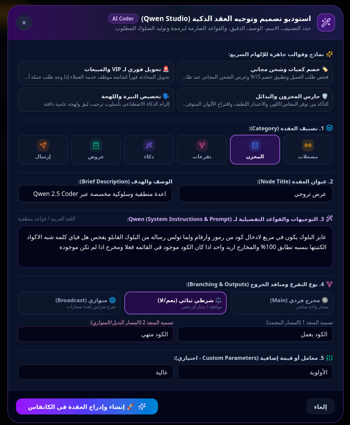
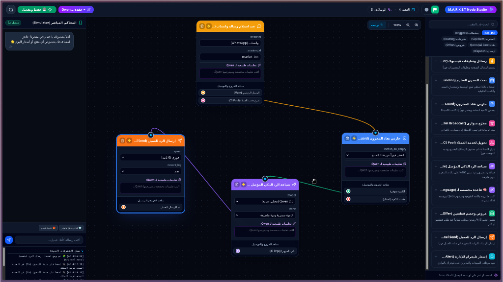

<p align="right">
  <a href="./README_ar.md">العربية</a> | <a href="./README.md">English</a>
</p>

<p align="center">
  <h1 align="center">منظومة M.A.R.K.E.T AI (الإصدار v4.0.0 للمؤسسات)</h1>
  <p align="center">
    <strong>محرك الأتمتة والاستجابة الذكي لخدمة التجارة والمبيعات وإدارة المخازن</strong><br/>
    <em>استوديو الكروت والمسارات المرئية (Visual Cards Studio)، أوركسترا نماذج الذكاء الاصطناعي المحلية، وأتمتة قنوات التجارة في الوقت الفعلي</em>
  </p>
</p>

<p align="center">
  <a href="https://github.com/ielfeqi-rgb/M.A.R.K.E.T/stargazers"></a>
  <a href="https://github.com/ielfeqi-rgb/M.A.R.K.E.T/network/members"></a>
  <a href="https://www.python.org/"></a>
  <a href="https://fastapi.tiangolo.com/"></a>
  <a href="https://www.sqlite.org/"></a>
  <a href="https://github.com/QwenLM/Qwen2.5"></a>
  <a href="https://www.docker.com/"></a>
  <a href="./LICENSE"></a>
</p>

---

## استوديو الكروت والمسارات المرئية (Visual Cards Studio)

<p align="center">
  
</p>

<p align="center">
  
</p>

**M.A.R.K.E.T v4.0.0** هي منصة مفتوحة المصدر واستضافة ذاتية (Self-Hosted) عالية الكفاءة للمؤسسات والتجار تجمع بين التنسيق المرئي للكروت وبين التوليد البرمجي المستقل لكود بايثون. تتيح المنظومة بناء وربط ومحاكاة كروت مسارات محادثات العملاء، كروت مطابقة أكواد الخصم، وتأصيل بيانات المخازن وقواعد البيانات عبر لوحة كروت لا نهائية (2D Cards Canvas) تترجم مباشرة إلى كود بايثون سريع وقابل للتنفيذ.

---

## المزايا والقدرات الرئيسية (v4.0.0 Enterprise)

- **لوحة كروت لا نهائية (Infinite 2D Cards Canvas)**: تصميم وربط كروت المسار مع مغناطيسية التوصيل والأسلاك الحسابية المنحنية ومؤشرات التأخير الزمني لكل خطوة.
- **توليد الكروت والكود الذكي (Qwen 2.5 Coder)**: محرك ذكاء مخصص يتلقى متطلبات المستخدم (مثل ربط ملفات إكسيل إضافية، فحص أكواد الخصم، جداول SQL) ويولد كروت تفاعلية جديدة وكود بايثون تنفيذي فوري.
- **أوركسترا تشغيل الموديلات المتزامنة (Dual-Model Concurrency)**: عزل تام بين موديل البرمجة وتوليد الكروت وموديل خدمة العملاء وقنوات التواصل لضمان السرعة الفائقة بدون أي تعارض.
- **قاعدة بيانات SQLite بنمط WAL الصارم**: منع الهلوسة بنسبة 100% عبر الاستعلام اللحظي (أقل من 1ms) والمزامنة المباشرة مع ملف products.xlsx.
- **بوابة قنوات التواصل الشاملة (Omni-Channel Gateways)**: دعم كامل لواتساب عبر OpenWA مع مسح رمز QR مباشرة من الواجهة، وفيسبوك ماسنجر، وتيك توك.
- **منصة فحص ومراقبة متكاملة (DevTools & Live Inspector Suite)**: تتبع تفصيلي لكل خطوة بالمللي ثانية، قياس استهلاك التوكنز والسرعة (Tokens / Sec)، واختبارات ضغط وتزامن الخادم.

---

## جدول مقارنة المنظومة

| الميزة | منظومة M.A.R.K.E.T | أدوات بناء التدفقات العامة | منصات الشات بوت السحابية |
| :--- | :--- | :--- | :--- |
| **استضافة ذاتية وحفظ الخصوصية** | نعم (استضافة محلية 100%) | جزئي | لا (احتكار سحابي) |
| **لوحة تدفقات بصرية لا نهائية** | نعم (2D Bezier Canvas) | نعم (Node Graph) | لا (شجرة خطوات خطية) |
| **توليد الكود البرمجي ذاتيا** | نعم (Qwen 2.5 Coder) | لا | لا |
| **تشغيل نماذج الذكاء محليا** | نعم (Ollama / Llama.cpp) | جزئي | لا (مفاتيح API مدفوعة فقط) |
| **بوابة واتساب مدمجة ومباشرة** | نعم (OpenWA عبر QR) | تتطلب وسيط خارجي | إضافة مدفوعة باهظة |
| **ربط وتأصيل المخزون اللحظي** | SQLite WAL + مزامنة Excel | تتطلب قاعدة خارجية | قواعد بيانات مغلقة |
| **تكلفة صفرية على كل رسالة** | نعم | نعم | لا (رسوم شهرية متصاعدة) |

---

## التشغيل والبدء السريع

### 1. المتطلبات الأساسية
- Python 3.10+ (يوصى بإصدار 3.12)
- Node.js 20+ (اختياري لتطوير الواجهة)
- Docker & Docker Compose (اختياري للتشغيل بالحاويات)

### 2. التثبيت والتشغيل

```bash
# استنساخ المستودع
git clone https://github.com/ielfeqi-rgb/M.A.R.K.E.T.git
cd M.A.R.K.E.T

# نسخ ملف الإعدادات
cp .env.example .env

# تشغيل السيرفر الموحد
chmod +x start.sh
./start.sh
```

### 3. الدخول إلى المنصة الموحدة
- الواجهة الموحدة للمنظومة: http://localhost:8000
- توثيق الـ API التفاعلي (Swagger): http://localhost:8000/docs
- مخطط OpenAPI JSON: http://localhost:8000/openapi.json

---

## أقسام المنظومة الموحدة

| القسم | الوصف والوظيفة | الوصول السريع |
| :--- | :--- | :--- |
| **لوحة القيادة والمؤشرات** | عدادات الهاردوير اللحظية، مراقبة الرام والمعالج، وحالة خادم الذكاء المحلي. | القائمة الجانبية -> لوحة القيادة |
| **استوديو الكروت والمسارات** | لوحة ربط الكروت، استوديو Qwen لتوليد الكروت، ومحاكي المحادثة اللحظي. | القائمة الجانبية -> استوديو الكروت |
| **منصة الفحص والتحليل** | تتبع أزمنة المسارات والكروت، محلل التوكنز، كونسول استعلامات SQL، واختبار الضغط. | القائمة الجانبية -> منصة الفحص |
| **المخزن وقاعدة البيانات** | جدول منتجات SQLite WAL، مؤشرات المخزون، والمزامنة مع الإكسيل. | القائمة الجانبية -> المخزن |
| **بوابة واتساب OpenWA** | عرض ومسح رمز الـ QR مباشرة، ومراقبة حالة البوابة واختبار الإرسال. | القائمة الجانبية -> بوابة واتساب |
| **إعدادات النظام والـ AI** | تبديل مزودي الذكاء (Gemini, Groq, Llama, Ollama) وحفظ البرومبت. | القائمة الجانبية -> الإعدادات |

---

## النشر والتشغيل عبر Docker

تشغيل الحزمة الكاملة (السيرفر الرئيسي + بوابة واتساب + قاعدة البيانات) عبر Docker Compose:

```bash
# بناء وتشغيل الحاويات في الخلفية
docker-compose up -d --build

# متابعة سجلات التشغيل الحية
docker-compose logs -f
```

---

## دعم المشروع والنجمة على GitHub

إذا كنت ترى أن منظومة M.A.R.K.E.T تقدم قيمة حقيقية لأعمالك أو مشاريعك البرمجية، نرجو دعم المستودع بالنجمة (Star) على GitHub للمساهمة في استمرار التطوير ونمو المجتمع البرمجي.

لطريقة وضع النجمة:
1. التوجه للرابط: https://github.com/ielfeqi-rgb/M.A.R.K.E.T
2. الضغط على زر Star في أعلى يمين الصفحة.

---

## شكر وتقدير للمشاريع مفتوحة المصدر

نبني هذه المنظومة على عمالقة البرمجيات مفتوحة المصدر:

- **FastAPI** -- بواسطة Sebastian Ramirez (@tiangolo).
- **Uvicorn** -- خادم الـ ASGI فائق السرعة.
- **Qwen Models** -- نماذج الذكاء الاصطناعي المتقدمة من Alibaba Cloud.
- **llama.cpp** -- محرك تشغيل نماذج الذكاء محليا بكفاءة C/C++.
- **OpenWA / WPPConnect** -- بوابة أتمتة واتساب.
- **SQLite** -- محرك التخزين والبيانات فائق السرعة بنمط WAL.
- **Lucide** -- مكتبة الأيقونات العصرية.
- **Tailwind CSS** -- إطار عمل التنسيق وتصميم الواجهات.

---

## الترخيص

تم ترخيص هذا المشروع تحت ترخيص **PolyForm NonCommercial License 1.0.0 (CC BY-NC-SA 4.0)**.  
مجاني بالكامل للاستخدام الشخصي، التعليمي، والمشاريع غير التجارية مفتوحة المصدر.
